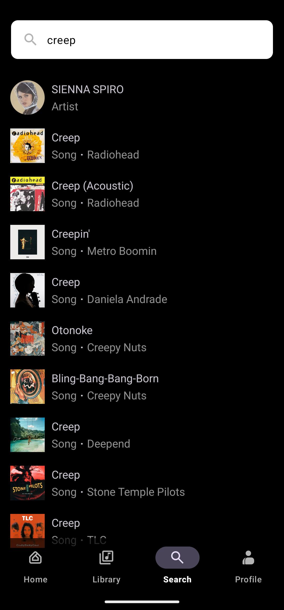

# 🎵 Musify

> An Android music player built to explore modern Android development patterns — featuring stream extraction, clean architecture, and a smooth playback experience.

---

## 📱 Overview

Musify is an Android music streaming app developed as a personal portfolio project. It demonstrates real-world use of **MVVM architecture**, **dependency injection with Hilt/Dagger**, and **Media3** for audio playback. Track URLs are resolved at runtime using a pipe extractor, enabling seamless on-demand streaming.

This project is purely educational and non-commercial — built to sharpen Android development skills and showcase architectural best practices.

---
 
## 📸 Screenshots
 
<p align="center">
  
  &nbsp;
  
  &nbsp;
  
  &nbsp;
  
</p>
 
---

## ✨ Features

- 🔍 **Search & discover** tracks
- ▶️ **Stream music** via pipe extractor URL resolution
- 🎚️ **Playback controls** — play, pause, skip, seek
- 📋 **Queue management**
- 🧭 **Fragment-based navigation** with a bottom navigation bar
- 💉 **Dependency injection** via Hilt & Dagger
- 🏗️ **Clean MVVM architecture** with repositories and ViewModels

---

## 🏛️ Architecture

Musify follows **MVVM (Model–View–ViewModel)** with a clean separation of concerns:

```
app/
├── ui/
│   ├── fragments/        # Screen fragments (Home, Search, Player, Queue...)
│   └── viewmodels/       # ViewModels per feature
├── data/
│   ├── repositories/     # Single source of truth for data
│   └── datasources/      # Remote / local data sources
├── domain/
│   └── models/           # Domain entities
├── di/
│   └── modules/          # Hilt modules for DI
└── player/
    └── MusicService.kt   # Media3 ExoPlayer service
```

### Data flow

```
Fragment  →  ViewModel  →  Repository  →  DataSource / Extractor
   ↑               |
   └───── LiveData / StateFlow
```

---

## 🛠️ Tech Stack

| Layer | Technology |
|---|---|
| Language | Kotlin |
| UI | Android Fragments, View Binding |
| Architecture | MVVM, Repository Pattern |
| DI | Hilt + Dagger |
| Playback | Media3 (ExoPlayer) |
| Stream extraction | NewPipe Extractor |
| Async | Kotlin Coroutines + Flow |
| Navigation | Jetpack Navigation Component |
| Image loading | Glide / Coil |

---

## 🚀 Getting Started

### Prerequisites

- Android Studio Hedgehog or later
- JDK 17+
- Android SDK 26+

### Clone & run

```bash
git clone https://github.com/Rimaro03/musify.git
cd musify
```

Open the project in Android Studio, let Gradle sync, then run on an emulator or physical device (API 26+).

---

## ⚠️ Disclaimer

Musify is a **personal learning project** built to practice Android development. It is not intended for commercial use or redistribution of copyrighted content. The pipe extractor integration is used solely for educational purposes to explore stream resolution techniques.

---

## 🤝 Contributing

This is a personal portfolio project, but feedback and suggestions are welcome! Feel free to open an issue or submit a pull request.

---

## 📄 License

```
MIT License — see LICENSE for details.
```

---

<p align="center">Made with ♥ to learn Android development</p>
